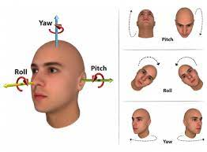

# Safe-Driving

### 1) Input video link: https://drive.google.com/file/d/1S3xf0qA3Aj7xUg5UptqSo3nsRdI9q-z5/view?usp=sharing
### output video:

### 2) Input video link: https://drive.google.com/file/d/1VYXbqz56h73kCGVWnIVd2EfR179W5FM7/view?usp=sharing
### output video:

# Description of terms:

<li> Eye status: Three types of eye status, It could be open, sleepy, drowsy or blinking.
<li> Yawn status: Whether the person is yawning or not.
<li> Blink Counter: It will count the blinks.
<li> Yawn Counter: It will count the yawns.
<li> Blink Duration: It's time duration between current blink and the last blink.
<li> Eye ratio: A Ratio calculated using the Eye keypoints which are predicted by the model.
<li> Mouth ratio: A Ratio calculated using the Lips keypoints which are predicted by the model.
<li> Head Direction: whether person is looking on the road or left/right.
<li> Gaze direction : It will show which direction person is looking at.
<li> Yaw, Roll, Pitch: These are the mesaurements of head orientation in 3D space.
  

